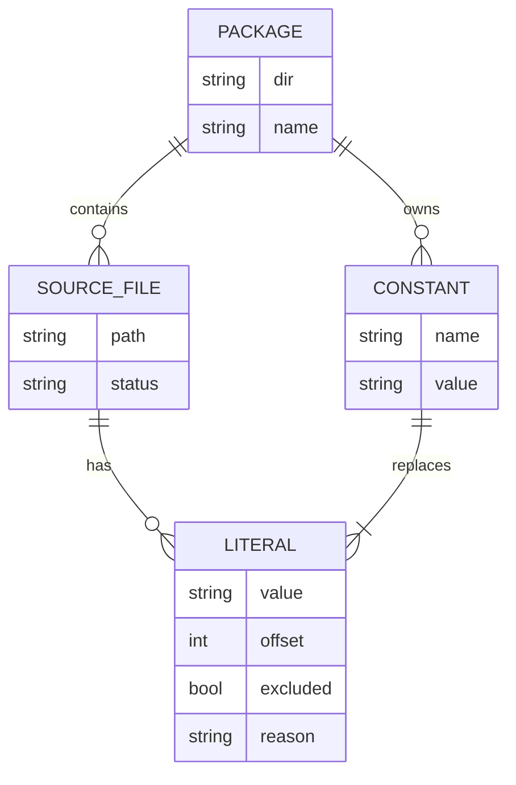
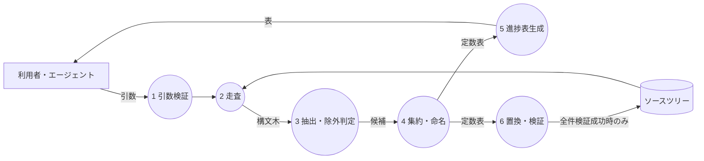
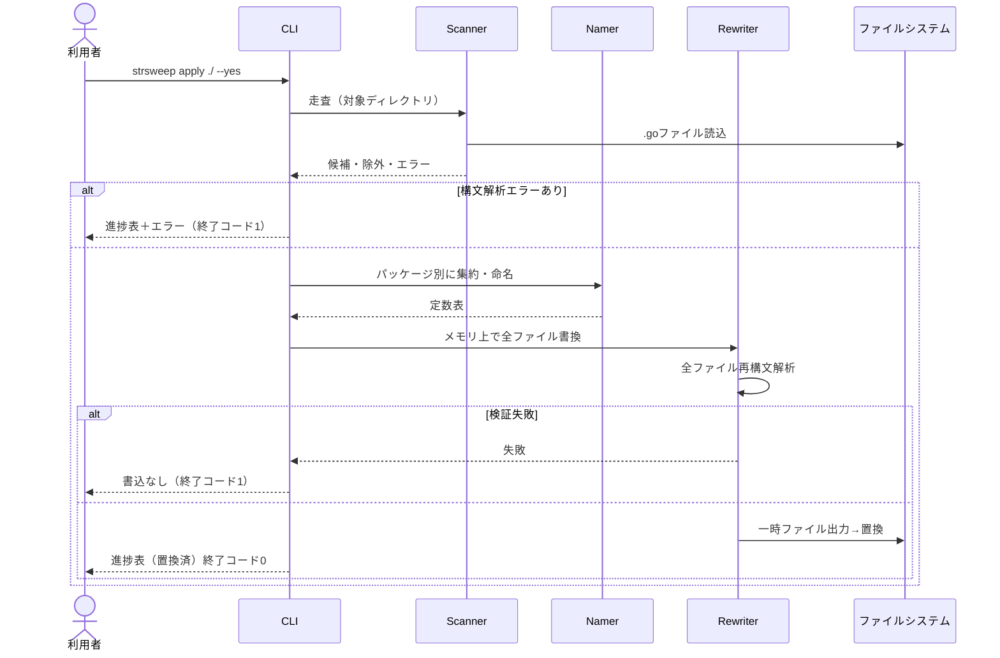
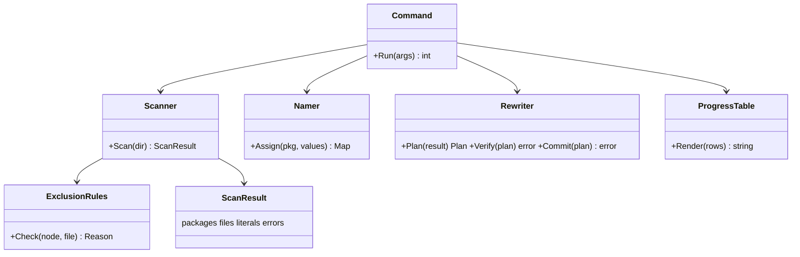
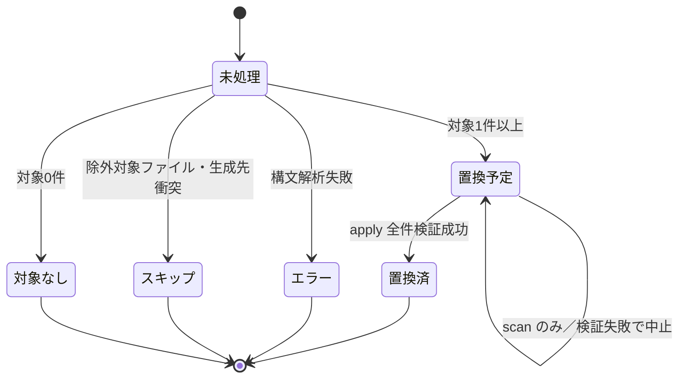
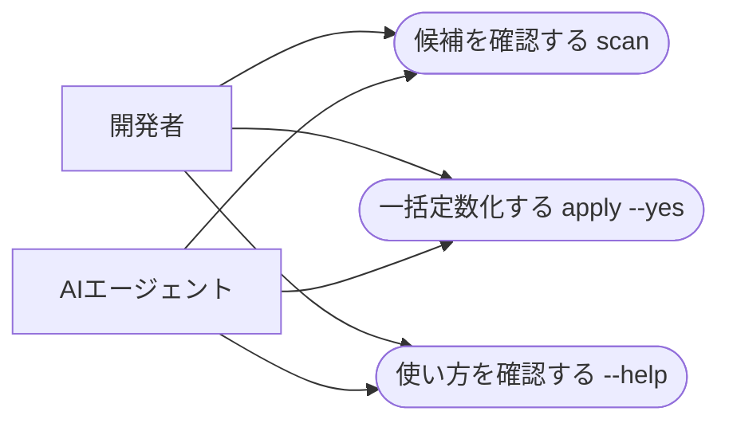

# strsweep デモ版 設計書

- リポジトリ名：`strsweep`
- コマンド名：`strsweep`
- エディション：デモ版（アイデアの視覚化）
- プラットフォーム：CLI（配布型）
- 実装言語：Go（標準ライブラリのみ。単一バイナリで配布）
- 参照日：2026-10-09

---

## 1. 概要

Goのソースツリーからハードコードされた文字列リテラルを抽出し、パッケージごとの定数ファイルへ一括で置き換えるCLIである。処理の各段階で、ファイル単位の進捗表を表示する。

本ツールは外部通信を持たず、利用者の環境で完結する。

## 2. プラットフォーム選定理由

- 成果物を直接実行するのは、開発者のシェル、またはエージェントのシェル実行である。既存のビルド手順・スクリプトに組み込まれて逐次実行されることが前提となるため、CLIが適する
- 外部通信がなく、APIのクライアントではないため、REST・GraphQL APIの配布形態ではなく、CLI単独で選定する
- 単一の独立したツールとして配布・バージョン管理するため、エージェントスキルの`scripts`ではなくCLIとして扱う
- 対象をGoソースに限定することで、標準ライブラリの構文解析器（`go/parser`・`go/ast`・`go/format`）が使え、外部依存なしで単一バイナリにできる

## 3. デモ版の範囲

| 項目 | 内容 |
|---|---|
| サブコマンド | `scan`（抽出と進捗表の表示）、`apply`（一括定数化）の2個 |
| 対象言語 | Go（`.go`ファイル） |
| 配布 | Gitリポジトリのみ。レジストリへの公開は行わない |
| `--help` | 最低限（用途・引数・終了コード） |
| 構造化出力 | なし（進捗表はテキスト） |
| デザイン・測定・保守・監視 | いずれも行わない |
| 外部通信・テレメトリ | 持たない |
| 資格情報 | 不要 |

## 4. 機能仕様

### 4.1 `strsweep scan <dir>`

対象ディレクトリ配下を再帰的に走査し、定数化の候補を一覧化する。ファイルへの書き込みは一切行わない。

出力内容：

1. 走査中の進捗（`[処理済ファイル数/総ファイル数] パス`）。標準エラー出力が端末のときのみ1行を上書き表示する。端末でないときは表示しない
2. ファイル単位の進捗表（標準出力）
3. 候補一覧（定数名・値・出現箇所数）

### 4.2 `strsweep apply <dir> --yes`

`scan`と同じ抽出を行い、全候補を定数へ置き換える。

- `--yes`がない場合は書き込みを行わず、終了コード2で終了する（対話的な確認待ちは行わない。非対話環境で停止しないため）
- 全ファイルの変更内容をメモリ上で生成し、すべての再構文解析が成功した場合のみ書き込みに進む。1件でも失敗した場合は一切書き込まない
- 書き込みは一時ファイルへの出力後に置き換える方式で行い、途中で中断しても元ファイルが壊れた状態で残らない
- 書き込み後、状態列を「置換済」に更新した進捗表を出力する

### 4.3 進捗表

| 列 | 意味 |
|---|---|
| ファイル | 対象ディレクトリからの相対パス |
| 検出 | 文字列リテラルの総数 |
| 除外 | 除外規則に該当した数 |
| 対象 | 定数化の対象となった数 |
| 状態 | `未処理` / `置換予定` / `置換済` / `スキップ（理由）` / `エラー（理由）` |

最終行に全ファイルの合計を表示する。表は検出数の多い順ではなく、パスの辞書順に並べる（実行ごとに同じ順序となるため）。

### 4.4 抽出規則（対象）

構文木上の文字列リテラル（通常文字列・raw文字列の両方）のうち、5.の除外規則に該当しないものを対象とする。判定は字句ではなく構文木で行い、コメント中・ほかの文字列中の引用符を誤検出しない。

### 4.5 除外規則

| 規則 | 理由 |
|---|---|
| import文のパス | 定数に置き換えると構文エラーになる |
| 構造体タグ | 定数を書けない位置である |
| 既存の`const`宣言内のリテラル | すでに定数である |
| 空文字列 `""` | 定数化による利益がない |
| `_test.go`ファイル | テストの期待値は読みやすさのためにリテラルのままが望ましい |
| 生成コード（`// Code generated ... DO NOT EDIT.`を含むファイル） | 再生成で上書きされる |
| 本ツールが生成した定数ファイル | 再実行時の二重処理を防ぐ |
| `vendor/`・`testdata/`・ドット始まりのディレクトリ | 自前のコードではない、またはビルド対象外である |
| 構文解析に失敗したファイル | 置換の安全性を担保できない。表には`エラー`として表示し、ほかのファイルの処理は継続しない（`apply`は全体を中止する） |

除外判定はキーワード照合ではなく構文上の位置で行うルールベース判定とする（デモ版のため分類器は用いない）。

### 4.6 定数の集約と命名

- 同一パッケージ内で値が完全一致するリテラルは、1つの定数に集約する
- パッケージが異なれば、同じ値でも別の定数とする（パッケージ間の依存を新たに生まないため）
- 定数名は非公開（小文字始まり）とし、パッケージの公開APIを変えない
- 命名規則：
  1. 値からASCII英数字の単語を先頭から最大4語取り出し、`str`を前置したキャメルケースにする（例：`"file not found"` → `strFileNotFound`）
  2. 英数字の単語を1つも取り出せない値（日本語のみ・記号のみ等）は、`strLit`に値のハッシュ先頭6桁（16進）を付ける
  3. パッケージ内の既存識別子・ほかの生成定数と衝突した場合は、末尾に`2`・`3`…を付ける
- 命名は値と既存識別子のみから決まり、走査順に依存しない。同じ入力からは常に同じ定数名が得られる

### 4.7 生成ファイル

- パッケージのディレクトリごとに`strsweep_const.go`を1つ生成する
- 先頭に本ツールによる生成である旨の目印コメントを置く。これにより再実行時は除外対象になる
- 同名の、目印のないファイルが既に存在する場合は、そのパッケージを`スキップ（生成先の衝突）`とし、利用者のファイルを上書きしない
- 定数は名前の辞書順に並べ、`go/format`で整形して出力する
- `package`名は同ディレクトリの既存ファイルから取得する。同ディレクトリに複数のパッケージ名が混在する場合（外部テストパッケージを除く）は、そのディレクトリをスキップする

### 4.8 冪等性

`apply`を2回続けて実行した場合、2回目は対象0件となり、ファイルを変更しない。

### 4.9 終了コード

| コード | 意味 | 再実行すべきか |
|---|---|---|
| 0 | 成功（対象0件を含む） | 不要 |
| 1 | 構文解析エラーのファイルがあった（`scan`は表示して終了、`apply`は書き込みを中止） | 該当ファイルの修正後に再実行 |
| 2 | 引数の誤り・`--yes`の欠落・ディレクトリが存在しない | 引数を直して再実行 |
| 3 | 書き込みの失敗（権限・容量） | 原因の解消後に再実行 |

エラーメッセージは標準エラー出力に出し、原因と再実行の要否を併記する。

### 4.10 非機能要件

- 対話的な入力待ちを一切持たない
- ネットワーク通信を一切行わない
- 対象ディレクトリの外へ書き込まない。シンボリックリンクは辿らない
- 置換後もファイルの改行コード・ファイル末尾の改行の有無を保つ
- 実在の個人を特定できる情報を成果物に含めない

## 5. ER図

配布型のCLIでありDBを持たないため、該当しない。

参考として、実行中にメモリ上で扱うデータの関係を示す。



## 6. DFD



## 7. シーケンス図（`apply`）



## 8. クラス図



Domain Core（Scanner・ExclusionRules・Namer・Rewriterの計画生成）は入出力の形式に依存せず、Commandと進捗表は薄いアダプタとして分離する。

## 9. 状態遷移図（ファイル単位）



## 10. ユースケース図



## 11. リポジトリ構成

```text
strsweep/
├─ src/
│  └─ strsweep/
│     ├─ cmd/strsweep/     # エントリポイント・引数解析
│     └─ internal/core/    # 走査・除外・命名・書換（Domain Core）
├─ test/
│  └─ fixtures/            # 検証用のGoソース群
└─ README.md
```

## 12. 規模

| 項目 | 値 |
|---|---|
| サブコマンド数 | 2 |
| 除外規則数 | 9 |
| 終了コード数 | 4 |
| 外部依存 | 0（Go標準ライブラリのみ） |
